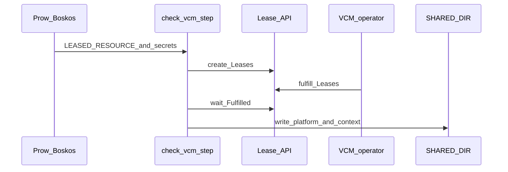

# vsphere-elastic, ci-operator, and openshift/release

This page maps how **OpenShift CI** (Prow, **ci-operator**, and the **step-registry**) reaches the vSphere Capacity Manager. Source of truth for paths below is the **[openshift/release](https://github.com/openshift/release)** repository (for example a local clone at `~/Development/release`).

## End-to-end flow

1. **Boskos** hands out an abstract quota slice (names like `vsphere-elastic-0`, `vsphere-elastic-1`, …). Types and resources are defined in [`core-services/prow/02_config/_boskos.yaml`](https://github.com/openshift/release/blob/master/core-services/prow/02_config/_boskos.yaml).
2. **ci-operator** turns a test that declares **`cluster_profile: vsphere-elastic`** in [`ci-operator/config`](https://github.com/openshift/release/tree/master/ci-operator/config) into a ProwJob annotated with **`ci-operator.openshift.io/cloud-cluster-profile: vsphere-elastic`**. Pods for that job see **`CLUSTER_PROFILE_NAME=vsphere-elastic`**.
3. **`ipi-conf-vsphere-check-vcm`** runs only when `CLUSTER_PROFILE_NAME` **is** `vsphere-elastic` (otherwise it exits immediately). It creates **`Lease`** resources (`apiVersion: vspherecapacitymanager.splat.io/v1`) in **`vsphere-infra-helpers`** using **`oc`** and **`SA_KUBECONFIG`** (default in the script: `/var/run/vault/vsphere-ibmcloud-ci/vsphere-capacity-manager-kubeconfig`). It waits until **`status.phase=Fulfilled`**, then writes install metadata under **`${SHARED_DIR}`** (`vsphere_context.sh`, `govc.sh`, `platform.yaml`, `subnets.json`, `LEASE_*.json`, `NETWORK_*.json`, etc.).
4. Other **`*-vcm`** steps read those files. **Legacy** steps (no `-vcm` suffix) do the opposite: they exit early when the profile **is** `vsphere-elastic`, so one workflow can serve both modes.



Scripts: [`ipi-conf-vsphere-check-vcm-commands.sh`](https://github.com/openshift/release/blob/master/ci-operator/step-registry/ipi/conf/vsphere/check/vcm/ipi-conf-vsphere-check-vcm-commands.sh), legacy sibling [`ipi-conf-vsphere-check-commands.sh`](https://github.com/openshift/release/blob/master/ci-operator/step-registry/ipi/conf/vsphere/check/ipi-conf-vsphere-check-commands.sh).

## Step-registry chains

Chains intentionally list **both** legacy and **`-vcm`** steps. Only the branch that matches **`CLUSTER_PROFILE_NAME`** does real work.

**Standard IPI configure chain** — [`ipi/conf/vsphere/ipi-conf-vsphere-chain.yaml`](https://github.com/openshift/release/blob/master/ci-operator/step-registry/ipi/conf/vsphere/ipi-conf-vsphere-chain.yaml):

- `ipi-conf-vsphere-check` then `ipi-conf-vsphere-check-vcm`
- `ipi-conf-vsphere-vips` then `ipi-conf-vsphere-vips-vcm`
- `ipi-conf-vsphere-dns`, `ipi-conf`, `ipi-conf-telemetry`, `ipi-conf-vsphere`, `ipi-conf-vsphere-vcm`, …

**Multi–vCenter IPI configure chain** — [`ipi/conf/vsphere/multi-vcenter/ipi-conf-vsphere-multi-vcenter-chain.yaml`](https://github.com/openshift/release/blob/master/ci-operator/step-registry/ipi/conf/vsphere/multi-vcenter/ipi-conf-vsphere-multi-vcenter-chain.yaml): same check/vips split, then `ipi-conf-vsphere-multi-vcenter` and `ipi-conf-vsphere-vcm`.

## Job configuration (ci-operator)

Set the cluster profile on the test (exact YAML shape depends on repo and file):

```yaml
tests:
- as: example-e2e
  steps:
    cluster_profile: vsphere-elastic
    env:
      POOLS: ""                         # optional: space-separated pool metadata names
      POOL_COUNT: "1"                  # pools to request when not using POOLS
      POOL_SELECTOR: "region=us-east"  # optional: comma-separated key=value → Lease poolSelector
      NETWORK_TYPE: single-tenant      # or multi-tenant, nested-multi-tenant, …
      OPENSHIFT_REQUIRED_CORES: "24"
      OPENSHIFT_REQUIRED_MEMORY: "96"
    workflow: openshift-e2e-vsphere-…
```

Authoritative env list and defaults for the check step: [`ipi-conf-vsphere-check-vcm-ref.yaml`](https://github.com/openshift/release/blob/master/ci-operator/step-registry/ipi/conf/vsphere/check/vcm/ipi-conf-vsphere-check-vcm-ref.yaml). Additional behavior (multi-NIC, multi-network failure domains, Vault-driven defaults) is described in comments at the top of `ipi-conf-vsphere-check-vcm-commands.sh`.

## Selectors and tolerations from CI

| Mechanism | In CI today |
|-----------|-------------|
| **`POOL_SELECTOR`** | Implemented: comma-separated `key=value` pairs are turned into **`spec.poolSelector`** on each created **Lease**. |
| **Tolerations** | Supported on the **Lease** API; see [scheduling.md](scheduling.md). The **check-vcm** script does **not** set tolerations from an environment variable. To use pool taints from Prow, you would extend the step or apply a custom manifest. |

## Other `-vcm` steps (step-registry)

All under **`ci-operator/step-registry/`**:

| Step | Role (high level) |
|------|---------------------|
| [`ipi/conf/vsphere/check/vcm`](https://github.com/openshift/release/tree/master/ci-operator/step-registry/ipi/conf/vsphere/check/vcm) | Create/wait on **Leases**; populate **`SHARED_DIR`**. |
| [`ipi/conf/vsphere/vips/vcm`](https://github.com/openshift/release/tree/master/ci-operator/step-registry/ipi/conf/vsphere/vips/vcm) | VIP handling for VCM-derived config. |
| [`ipi/conf/vsphere/vcm`](https://github.com/openshift/release/tree/master/ci-operator/step-registry/ipi/conf/vsphere/vcm) | Build **`install-config.yaml`** from VCM context. |
| [`upi/conf/vsphere/vcm`](https://github.com/openshift/release/tree/master/ci-operator/step-registry/upi/conf/vsphere/vcm) | UPI configure path when profile is `vsphere-elastic`. |
| [`upi/conf/vsphere/ova/vcm`](https://github.com/openshift/release/tree/master/ci-operator/step-registry/upi/conf/vsphere/ova/vcm) | OVA step sibling for elastic profile. |
| [`ipi/deprovision/vsphere/diags/vcm`](https://github.com/openshift/release/tree/master/ci-operator/step-registry/ipi/deprovision/vsphere/diags/vcm) | Diagnostics deprovision for VCM workflows. |

## See also

- [doc.md](doc.md) — tables of **`SHARED_DIR`** files, VCM vs legacy step pairs, multi-tenant Vault lists, and job examples.
- [scheduling.md](scheduling.md) — `poolSelector`, taints, tolerations on the CRs themselves.
- [concepts.md](concepts.md) — Pool, Lease, Network.
