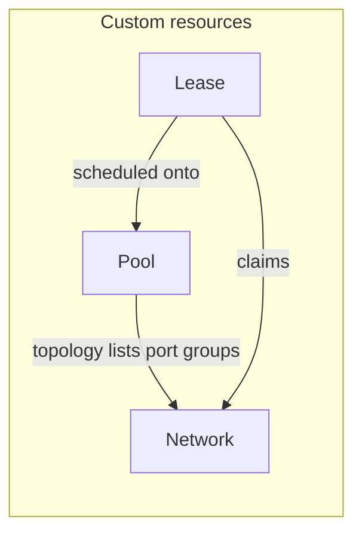

# Concepts

## Pool

A **Pool** is one schedulable slice of vSphere capacity: vCenter connection, datacenter / cluster / datastore topology, total vCPU and memory, and the list of **port group paths** that may be used for installs.

- **Status** fields (`vcpus-available`, `memory-available`, `network-available`, `lease-count`) reflect what the operator thinks is still free after fulfilled leases.
- **exclude**: pool is skipped by default scheduling; a lease can still target it with `spec.required-pool` (or match via labels/tolerations as documented in [scheduling](scheduling.md)).
- **noSchedule**: like cordoning a node — existing leases stay; **new** leases are not placed here.

## Lease

A **Lease** is a request for resources: vCPU, memory, number of networks (today **`spec.networks` is 1**), optional storage, and optional **network type** (single-tenant, multi-tenant, etc.).

When the operator can place the lease, **status.phase** becomes **Fulfilled** and status carries failure-domain and env information consumers use to build install configs.

For **multiple failure domains** (e.g. multiple vSphere clusters), create **one Lease per domain**.

## Network

A **Network** CR describes one vSphere **port group** at a given **pod** / **datacenter**: VLAN, machine CIDR, gateways, etc. Only networks that are both **listed on a Pool** and **not already owned by another lease** can be assigned.

See [Purpose-built networks](networks-purpose-built.md) for how to add one.

## How they connect

The operator’s job is to pick a **Pool** with enough free capacity, then a **Network** that matches the lease’s **network-type** and is tied to that pool.
