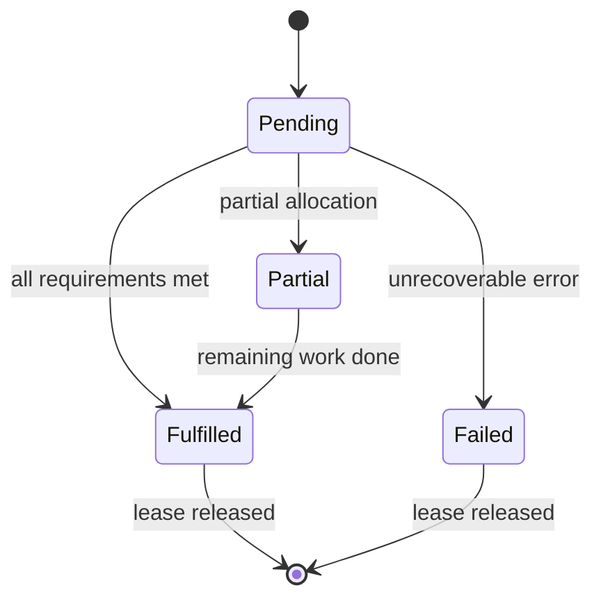

# How it works

## High-level flow

1. A **Lease** is created (or updated) with CPU, memory, network count, and optional scheduling constraints.
2. The operator finds **Pool**(s) that fit capacity and policy ([scheduling](scheduling.md)).
3. For each pool, it looks for a free **Network** compatible with `spec.network-type`.
4. When successful, it updates **Lease status** (phase **Fulfilled**, pool info, env snippets) and records ownership so the network is not double-booked.

Phases are defined in the API (for example `Pending`, `Partial`, `Fulfilled`, `Failed`). Conditions on the Lease give more detail while work is in progress.

## Related leases and networks

When several leases share the same **boskos-lease-id** label and the **same vCenter**, the operator tries to give them a **consistent network** story so multi–failure-domain jobs can coordinate. (See [repository README](../README.md) for the short bullet list.)

## Where to go next

- [Scheduling](scheduling.md) — labels, taints, `required-pool`
- [CLI](cli.md) — inspect Pools, Leases, Networks
- [CI-focused detail](doc.md) — Prow, `vsphere-elastic`, files under `SHARED_DIR`
